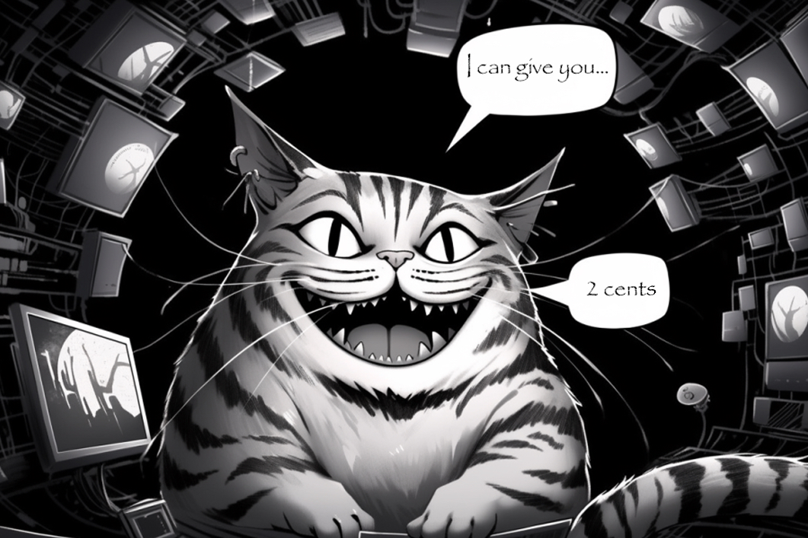

<a name="readme-top"></a>

<!-- PROJECT LOGO -->
<br />
<div align="center">
  <h2 align="center">Cheshire-Cat (Stregatto)</h2>
  
  <h4 align="center">
    Customizable AI architecture
  </h4>
</div>


## What is this?

If you want to build a custom AI on top of a language model, the Cat can help you:

- 🌍 Language model agnostic (works with OpenAI, Cohere, HuggingFace models, custom)
- 🐘 Long term memory
- 🔧 Can use external tools (APIs, custom python code, other models)
- 🖺 Can ingest documents (.pdf, .txt, .md)
- 🚀 Extendible via plugins
- 🐋 100% [dockerized](https://docs.docker.com/get-docker/)


## Quickstart

You just need `docker` and `docker-compose` installed on your system.
Clone the repo and cd into it. Now set up your language model.

Create an empty `.env` file. Its content depends on what language model you want to use.

<details><summary>I want to use OpenAI</summary>

### OpenAI configuration

Put in your `.env` file this line:

```
OPENAI_KEY=<your-openai-key>
```
</details>

<details><summary>I want to use HuggingFace</summary>

Cheshire-Cat Loves HuggingFace!
Put in your `.env` file:

```
HF_TOKEN=<your-huggingface-token>
HF_CHECKPOINT=<selected-checkpoint>
```

example:

```
HF_TOKEN=hf_yourtoken
HF_CHECKPOINT=decapoda-research/llama-13b-hf
```

If you want to use your HuggingFace Endpoint write in your `.env` file
```
HF_TOKEN=<your-huggingface-token>
HF_ENDPOINT_URL=<your-huggingface-endpoint>
```
</details>

<details><summary>I want to use Cohere</summary>

### Cohere configuration

Put in your `.env` file this line:

```
COHERE_KEY=<your-cohere-key>
```
</details>

<br>

After that you can run:

```bash
docker-compose up
```

The first time (only) it will take several minutes, as the images occupy a few GBs.

- Chat with the Cheshire Cat on [localhost:3000](http://localhost:3000).
- You can also interact via REST API and try out the endpoints on [localhost:1865/docs](http://localhost:1865/docs)

When you're done, remember to CTRL+c in the terminal and
```
docker-compose down
```


<p align="right">(<a href="#readme-top">back to top</a>)</p>


## Docs and Resources

- [Discord Server](https://discord.gg/rSm9htk9pA)
- [YouTube Presentation: Meet the CHESHIRE CAT - Open Source AI](https://youtu.be/srsaYy0xmkc)


## Roadmap

Here's the plan and vision for the development of the ChechireCat v1.
For the full Roadmap, check out [here](./ROADMAP.md). Whilst for the current progress of development, take a look at the [projects](https://github.com/pieroit/cheshire-cat/projects?query=is%3Aopen) marked as open.

* [Forms from JSON schema](./ROADMAP.md#forms-from-json-schema)
* [Configurations](./ROADMAP.md#configurations)
	* [Language model provider](./ROADMAP.md#language-model-provider)
	* [Embedder](./ROADMAP.md#embedder)
* [Plugins list](./ROADMAP.md#plugins-list)
* [Reasoning](./ROADMAP.md#reasoning)
* [Documentation](./ROADMAP.md#documentation)
* [Markdown support](./ROADMAP.md#markdown-support)
* [Separate `admin` app from `public` static index.html](./ROADMAP.md#separate-admin-from-public)


## Contributing

If you have a suggestion that would make this better, open an issue and we can reason about it.
If you want to contribute code, fork the repo and create a pull request.

1. Try out the Cat
1. Fork the Project
2. Create your Feature Branch (`git checkout -b feature/AmazingFeature`)
3. Commit your Changes (`git commit -m 'Add some AmazingFeature'`)
4. Push to the Branch (`git push origin feature/AmazingFeature`)
5. Open a Pull Request ((if it contains lots of code, please discuss it beforehand opening a issue))

You can start simply by:
- Making tutorials and docs
- Sharing on social media


Before submitting any new pull request, make sure it either fixes an [existing issue](https://github.com/pieroit/cheshire-cat/issues) or is something we have discussed in our [Roadmap](#roadmap). 
If you have any ideas on how to improve the project or if you'd like to suggest new developments, please [join our community on Discord](https://discord.gg/rSm9htk9pA)

Don't forget to give the project a star!⭐ Thanks again!🙏

## Naming Convention

This project follows the **PEP8** naming convention for all backend code. Please ensure that your contributions adhere to this standard.

## Credits

Logo image generated with MidJourney, prompted by [Edgars Romanovskis](https://www.linkedin.com/in/edgars-romanovskis-b28826259/)

## Which way to go?

<p align="right">(<a href="#readme-top">back to top</a>)</p>

<p align="center">
    
</p>

```
"Would you tell me, please, which way I ought to go from here?"
"That depends a good deal on where you want to get to," said the Cat.
"I don't much care where--" said Alice.
"Then it doesn't matter which way you go," said the Cat.

(Alice's Adventures in Wonderland - Lewis Carroll)

```
