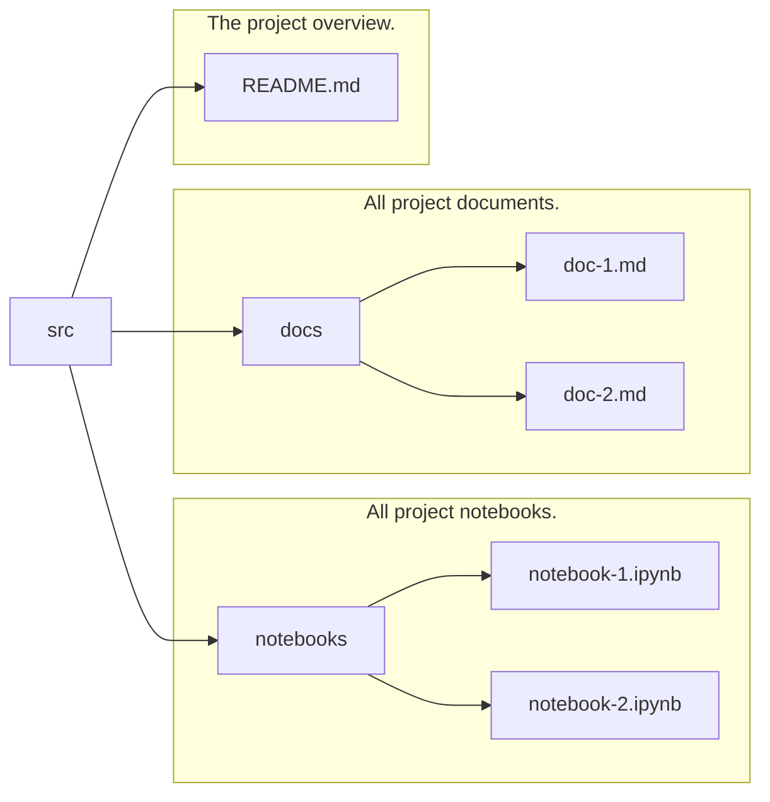

# 🐱 Cheshire cat UI

> 🐱: Well, well, well, what do we have here?\
> It appears that you've stumbled upon my UI repository, my dear.\
> This codebase is none other than the Cheshire cat UI, crafted with the finest React technology. So, come on in and
> take a peek, but be warned, things might get curiouser and curiouser from here on out!

## Table of contents

<!-- TABLE OF CONTENTS -->
<details open>
  <summary>Table of Contents</summary>
  <ol>
    <li><a href="#about-the-project">About The Project</a></li>
    <li>
      <a href="#contributing">Contributing</a>
      <ul>
        <li><a href="#prerequisites">Prerequisites</a></li>
        <li><a href="#installation">Installation</a></li>
            <li><a href="#scripts">Scripts</a>
            <ul>
                <li><a href="#dev-mode">Dev mode</a></li>
                <li><a href="#build">Build</a></li>
                <li><a href="#start-the-app">Start the app</a></li>
            </ul>
        </li>
      </ul>
    </li>
<li><a href="#folder-structure">Folder structure</a></li>
    <li><a href="#guidelines-and-standards">Guidelines and standards</a></li>
  </ol>
</details>

## About the project

The Cheshire Cat platform is a cutting-edge, open-source solution that enables users to optimize their personal AI
architecture with ease.

- Language model agnostic, allows compatibility with OpenAI, Cohere, HuggingFace, and custom models
- Long term memory storage capabilities
- Seamless integration with external tools, such as APIs and other models
- Ability to ingest various document formats, including PDFs and text files
- 100% dockerized for simple and efficient deployment
- Extensibility via plugins, offering unparalleled flexibility to users.

## Contributing

The Cheshire Cat platform has been fully containerized using Docker, which allows for effortless access to the UI with
minimal setup requirements.\
Simply follow the instructions outlined in the
primary [README.md](https://github.com/pieroit/cheshire-cat/blob/main/README.md) file to get started.

However, if you want to tinker around with the UI application in development mode, we've got you covered.
Just make sure to follow these instructions closely

### Pre-requisites

Make sure you have the following installed on your machine:

```bash
  node v18.15+
```

### Installation

Chose your preferred package manager and install the dependencies

```bash
  npm install
```

### Scripts

Here's a list of scripts that you can run to get the app up and running

#### Dev mode

Run the app in dev mode with hot-reloading enabled and the browser automatically opening on port `3000`

```bash
  npm run dev
```

#### Build

Build the app for production

```bash
  npm run build
```

#### Start the app

Runs the build and serves the built app on port `3000`

```bash
  npm run start
```

## Folder structure



```md
.
├── public/ <-- Static files that are served by the app
├── src/
│ ├── components/ <-- Reusable stateless components
│ │ ├── ComponentName/ <-- A component module
│ │ │ ├── ComponentName.tsx <-- The component itself
│ │ │ ├── ComponentName.module.scss # The component's styles
│ │ │ └── index.ts # Exports relevant files from module
│ │ │
│ ├── hooks/ # Reusable custom hooks
│ │ ├── useSomething.ts # A hook file
│ │ │
│ ├── models/ # The application's models
│ │ ├── common.ts # Common model types
│ │ ├── ModelName.ts # A model file
│ │ │
│ ├── routes/ # The application's pages and subpages
│ │ ├── RouteName/ # A route module
│ │ │ ├── RouteName.tsx # The route itself, can be a smart component
│ │ │ ├── RouteName.module.scss # The route's styles
│ │ │ └── index.ts # Exports relevant files from module
│ │ ├── browserRouter.tsx # The application's router
│ │ │
│ ├── services # The application's services
│ │ ├── service.ts # A service file
│ │ │
│ ├── store # The application's redux store containing the business logic
│ │ ├── stateName # A state slice module
│ │ │ ├── slice.ts # The slice itself
│ │ │ ├── types.ts # The slice's types
│ │ │ └── selectors.ts # The selectors functions for the slice
│ │ │
│ ├── theme # The application's styles
│ │ ├── libs/ # contains third party CSS libraries
```

## Guidelines and standards

Here's the list of guidelines and standards that must be followed while contributing to this the Cheshire Cat UI
application.
Please read and understand these guidelines before contributing to the application.
