# Rabbit Hole

The Rabbit Hole is the Cat's component that takes care of ingesting documents and storing them in the [episodic memory](../memory/long_term_memory.md).
You can interact with it either through its [endpoint](../../technical/basics/basics.md), the [GUI](../../technical/basics/admin-interface.md) or a Python script. 

Currently supported file formats are: `.txt`, `.md`, `.pdf` or `.html` via web URL.

## Rabbit Hole flow :material-information-outline:{ title="click on the nodes with hooks to see their documentation" }

!!! note "Developer documentation"
    [Rabbit Hole hooks](../../technical/plugins/hooks.md)

```mermaid

flowchart LR
A["📄Document"] --> B[read];
subgraph rb ["🐰RabbitHole"]
B[read] --> C["🪝"];
C["🪝"] --> D[recursive split];
D["🪝recursive split"] --> E["🪝"];
E["🪝"] --> F["🪝summarization"];
F["🪝summarization"] --> G["🪝"];
end
G["🪝"] --> H["🐘Episodic Memory"] 
```

Nodes with the :hook: point the execution places where there is an available [hook](../plugins.md) to customize the execution pipeline.

