# Long Term Memory

The Cat's Long Term Memory (LTM) is made of two components:

- *episodic memory*, i.e. the context of documents uploaded to the Cat;
- *declarative memory*, i.e. the context of things the user said in the past.

These are nothing but two [vector databases](vector_memory.md) where memories are stored in the form of vectors.

You can interact with the LTM using its [endpoint]().

By default, the Cat queries the LTM to retrieve the relevant context that is used to make up the [Main Prompt](../prompts/main_prompt.md).

## Long Term Memory flow :material-information-outline:{ title="click on the nodes with hooks to see their documentation" }

!!! note "Developer documentation"
    [Long Term Memory hooks](../../technical/plugins/hooks.md)

```mermaid
flowchart LR
    subgraph LTM ["🐘Long Term Memory"]
            direction TB
            C[(Episodic)];
            D[(Declarative)];
    end
    A[Query] --> LTM; 
    LTM --> E["🪝"];
    E["🪝"] --> wm["⚙️🐘Working Memory"];
```

Nodes with the :hook: point the execution places where there is an available [hook](../plugins.md) to customize the execution pipeline.
