# Vector Memory Collections

The Vector Memory Collections are the lowest-level components of the [Long Term Memory](long_term_memory.md). 
These are particular databases that store the content in the form of geometrical vectors.

A vector memory comes in the form of a named collection of vectors and additional, optional metadata.
Each vector represents a memory.  
They are also called *embeddings* as they are the results of the text-to-vector conversion yielded 
by the [embedder](../language_models/llm.md). 

Such databases are particularly useful as they allow to fetch relevant memories based on the vector similarity
between a query and the stored embeddings.

By default, Vector Memory Collections are created when the Cat is installed or after a complete memory swap.

### Vector Memory Collections flow :material-information-outline:{ title="click on the hooks node to see the hooks documentation" }

!!! note "Developer documentation"
    [Vector Memory Collections hooks](../../technical/plugins/hooks.md)

```mermaid
flowchart LR
    subgraph CAT ["🐱Cheshire Cat"]
        direction LR
        subgraph LTM ["🐘Long Term Memory"]
            direction LR
            C[(Episodic Memory)];
            D[(Declarative Memory)];
        end
        A["🪝first memory"] --> C[(Episodic Memory)];
        A["🪝first memory"] --> D[(Declarative Memory)];
    end
    E[First Installation] --> CAT;
    F[Memory Swap] --> LTM;
```

Nodes with the :hook: point the execution places where there is an available [hook](../plugins/hooks.md) to customize the execution pipeline.

