# Hypothetical Document Embedding Prompt

Hypothetical Document Embedding (HyDE)[^1] is a technique used to improve accuracy during similarity search among documents.

Similarity search is the task of comparing text [*embeddings*](../llm.md#embedding-model), i.e. the vector representation of documents,
to find similarities between them, e.g. during document question-answering. 

As such, HyDE technique consists in asking the [language model](../llm.md#completion-model) to generate a hypothetical answer that is used as query for the similarity search task.
The idea behind this approach is that, during in a question-answering task, using the hypothetical answer to search for similar documents would lead to better results than using the question itself as a search query.

Specifically, the Cat uses this method to retrieve the relevant memories that are provided as context and end up in the [Main Prompt](main_prompt.md).   
Moreover, it exploits a technique named few shots learning[^2]. 
Namely, a method that consists in providing the [language model](../llm.md#completion-model) a few examples in the prompt to get more accurate answers.

By default, the HyDE prompt is the following:
```python
hyde_prompt = """You will be given a sentence.
If the sentence is a question, convert it to a plausible answer. 
If the sentence does not contain a question, 
just repeat the sentence as is without adding anything to it.

Examples:
- what furniture there is in my room? --> In my room there is a bed, 
a wardrobe and a desk with my computer
- where did you go today --> today I was at school
- I like ice cream --> I like ice cream
- how old is Jack --> Jack is 20 years old

Sentence:
- {input} --> """
```

## HyDE flow :material-information-outline:{ title="click on the nodes with hooks to see their documentation" }

!!! note "Developer documentation"
    - [HyDE hooks](../../technical/plugins/hooks.md)
    - [Prompts hooks](../../technical/plugins/hooks.md)

```mermaid
flowchart LR
    subgraph cat ["🐱Cheshire Cat"]
    direction LR
    hyde["🪝HyDE prompt"] --> llm[Language Model];
    llm -->|generates|answer[Hypothetical Answer];
    answer -->|similarity search|ltm["🐘Long Term Memory"];
    ltm --> context[Relevant Context];
    context --->|inserted in|prompt[Main Prompt];
    end
    A["👤User"] ---->|sends message|hyde;
    A --> prompt
```



Nodes with the :hook: point the execution places where there is an available [hook](../plugins.md) to customize the execution pipeline.

## References

[^1]: Gao, L., Ma, X., Lin, J., & Callan, J. (2022). Precise Zero-Shot Dense Retrieval without Relevance Labels. arXiv preprint arXiv:2212.10496.

[^2]: Brown, T., Mann, B., Ryder, N., Subbiah, M., Kaplan, J. D., Dhariwal, P., ... & Amodei, D. (2020). Language models are few-shot learners. Advances in neural information processing systems, 33, 1877-1901.
