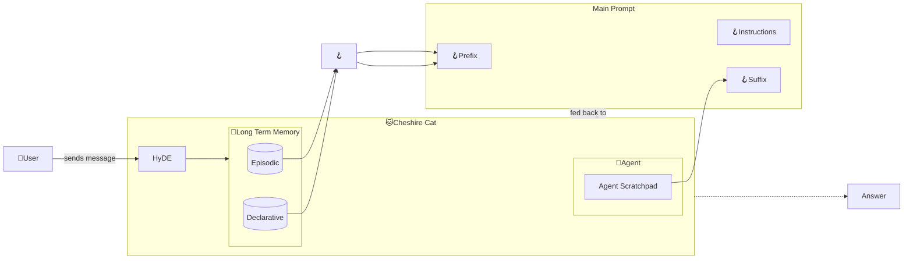

# Main Prompt

The Main Prompt is the full set of instructions that is fed to the [*Agent*](../cheshire_cat/agent.md).
For instance, the prompt can be engineered to instruct the Cat to behave in a specific manner or to use the memory and the [tools](../plugins.md).
 
This prompt is split in three parts:

- a prefix;
- the instructions;
- a suffix.

Using such a complex prompt is an approach know as Retrieval Augmented Generation[^1]. 
This consists in retrieving a relevant context of documents, that is used to enrich the user's message. 
Specifically, the Cat exploits the [Hypothetical Document Embedding](hyde.md)[^2] (HyDE) technique to recall the relevant
context from the [Long Term Memory](../memory/long_term_memory.md) and, indeed, augment the Main Prompt. 
This is also augmented with the history of the recent conversation, a set of [tools](../plugins.md) and the history the [Agent's](../cheshire_cat/agent.md) reasoning.

In the following sections, we explain every prompt component.

## Prefix

This is the first component. By default, it is:
```python
prefix = """This is a conversation between a human and an intelligent robot cat that passes the Turing test.
The cat is curious and talks like the Cheshire Cat from Alice's adventures in wonderland.
The cat replies are based on the Context provided below.

Context of things the Human said in the past:{episodic_memory}

Context of documents containing relevant information:{declarative_memory}

If Context is not enough, you have access to the following tools:
"""
```
As you may notice, the Prefix sets the information context bearing two placeholder: one for the [episodic memory](../memory/long_term_memory.md) and the other for the [declarative memory](../memory/long_term_memory.md).
It also informs the Cat about whom the Cat is.

## Instructions

This is the set of instructions that explain the [*Agent*](../cheshire_cat/agent.md) how to format its reasoning. 
The [*Agent*](../cheshire_cat/agent.md) uses such chain of thoughts to decide *when* and *which* [tool](../plugins.md) is the most appropriate to fulfill the user's needs.

By default, it is:
```python
instructions = """To use a tool, please use the following format:

\```
Thought: Do I need to use a tool? Yes
Action: the action to take, should be one of [{tool_names}]
Action Input: the input to the action
Observation: the result of the action
\```

When you have a response to say to the Human, or if you do not need to use a tool, you MUST use the format:

\```
Thought: Do I need to use a tool? No
{ai_prefix}: [your response here]
\```"""
```
where the placeholder `{tool_names}` is replaced with the list of the available Python [tools](../plugins.md) names.

## Suffix

This is the last component of the Main Prompt and, by default, is set as follows:
```python
suffix = """Conversation until now:{chat_history}
 - Human: {input}

What would the AI reply?
Answer concisely to the user needs as best you can, according to the provided recent conversation, context and tools.


{agent_scratchpad}"""
```

The main goal of this component is to provide the Cat with the recent conversation history, followed by the user's input. 
Lastly, the `{agent_scratchpad}` is the collection of notes the Cat reads from and writes to its reasoning when performing chain of thoughts.

## Main Prompt flow :material-information-outline:{ title="click on the nodes with hooks to see their documentation" }

!!! note "Developer documentation"
    [Main Prompt hooks](../../technical/plugins/hooks.md)



Nodes with the :hook: point the execution places where there is an available [hook](../plugins.md) to customize the execution pipeline.

## References

[^1]: Lewis, P., Perez, E., Piktus, A., Petroni, F., Karpukhin, V., Goyal, N., ... & Kiela, D. (2020). Retrieval-augmented generation for knowledge-intensive nlp tasks. Advances in Neural Information Processing Systems, 33, 9459-9474.

[^2]: Gao, L., Ma, X., Lin, J., & Callan, J. (2022). Precise Zero-Shot Dense Retrieval without Relevance Labels. arXiv preprint arXiv:2212.10496.
