# Summarization Prompt

The Summarization Prompt is nothing more than the instruction to ask the [*Agent*](../cheshire_cat/agent.md) to summarize a document.
This step is borne by the [Rabbit Hole](../cheshire_cat/rabbit_hole.md) when storing documents in the [episodic memory](../memory/long_term_memory.md).   

This is an iterative process: a document is split in chunks; each chunk is grouped and summarized iteratively until only one summary remains.

By default, the Summarization Prompt is the following:
```python
summarization_prompt = """Write a concise summary of the following:
{text}
"""
```

## Summarization flow :material-information-outline:{ title="click on the nodes with hooks to see their documentation" }

!!!! note "Developer documentation"
    [Summarization hooks](../../technical/plugins/hooks.md)  
    [Rabbit Hole hooks](../../technical/plugins/hooks.md)

```mermaid

flowchart LR
A["📄Document"] --> B[read];
subgraph rb ["🐰RabbitHole"]
B[read] --> C["🪝"];
C["🪝"] --> D[recursive split];
D["🪝recursive split"] --> E["🪝"];
E["🪝"] --> F["🪝summarization"];
F["🪝summarization"] --> G["🪝"];
end
G["🪝"] --> H["🐘Episodic Memory"] 
```



Nodes with the :hook: point the execution places where there is an available [hook](../plugins.md) to customize the execution pipeline.
