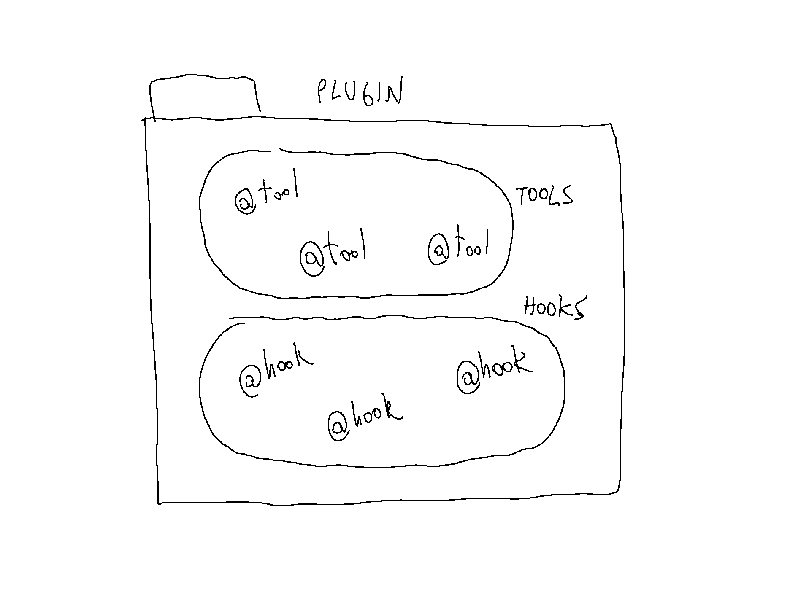

# How to write a plugin

To write a plugin just create a new folder in `web/cat/plugins/`.  
Add a python file to your plugin folder:

    ├── web
    │   ├── cat
    │   │   ├── plugins
    |   |   |   ├── myplugin
    |   |   |   |   ├ mypluginfile.py

Now let's start `mypluginfile.py` with a little import:

    from cat.mad_hatter.decorators import tool, hook

You are now ready to change the Cat's behavior using Tools and Hooks.

## Hooks

Hooks let you influence how the Cat runs its internal functionality.  
More details on hooks [here](hooks.md)

## Tools

Tools let you define custom code that the Cat can use.  
More details on tools [here](tools.md)

TODO: the difference is not clear, find better working and simple examples
