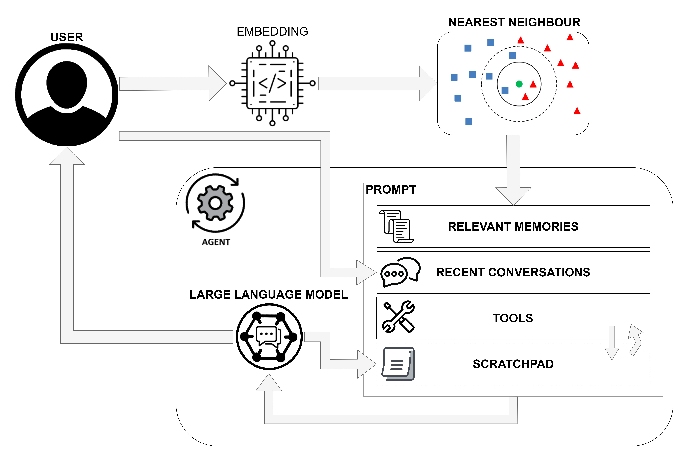
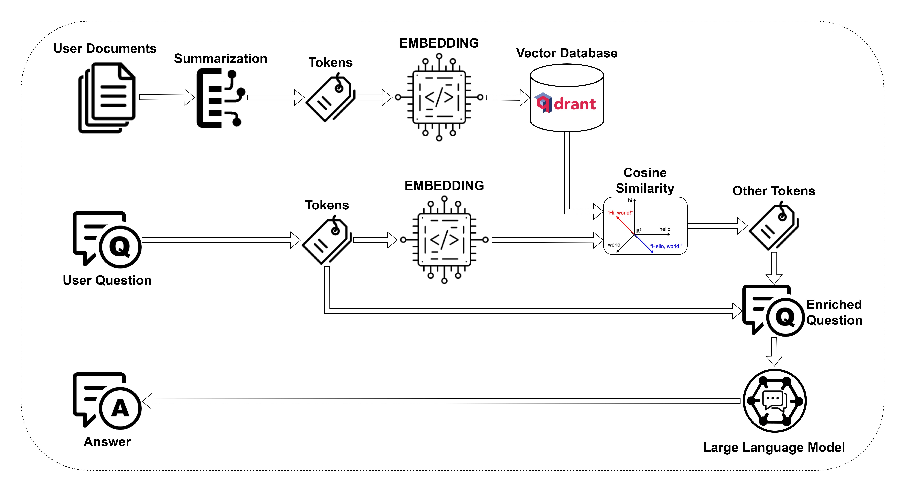

# :smirk_cat: How the Cat works

   
   

## Components   

The Cheshire Cat is made of many pluggable components that make it fully customizable.

:speech_balloon: `Chat`
:   This is the Graphical User Interface (GUI) component that allows you to interact directly with the Cat. 
    From the GUI, you can also set the language model you want the Cat to run.

:rabbit: `Rabbit Hole`
:   This component handles the ingestion of documents.   
    Files that are sent down the *Rabbit Hole* are split into chunks and saved in the Cat's *declarative memory* to be further retrieved in the conversation. <link to declarative memory>

:brain: `Large Language Model (LLM)`
:   This is one of the core components of the Cheshire Cat framework. 
    A LLM is a Deep Learning model that's been trained on a huge volume of text data and can perform many types of language tasks.
    The model takes a text string as input (e.g. the user's prompt) and provides a meaningful answer. 
    The answer consistency and adequacy is enriched with the context of previous conversations and documents uploaded in the Cat's memory.

:dna: `Embedder`
:   The embedder is another Deep Learning model similar to the LLM. Differently, it doesn't perform language tasks.
    The model takes a text string as input and encodes it in a numerical representation. 
    This operation allows to represent textual data as vectors and perform geometrical operation on them.
    For instance, given an input, the embedder is used to retrieve similar sentences from the Cat's memory.

:elephant: `Vector Memory`
:   As a result of the *Embedder* encoding, we get a set of vectors that are used to store the Cat's memory in a vector database.
    Memories store not only the vector representation of the input, but also the time instant and personalized metadata to facilitate and enhance the information retrieval.
    The Cat embeds two types of vector memories, namely the *episodic* and *declarative* memories. 
    The formers are the things the human said in the past; the latter the documents sent down the *Rabbit hole*. 

:robot: `Agent`
:   This is another core component of the Cheshire Cat framework.   
    The agent orchestrates the calls that are made to the LLM. 
    This component allows the Cat to decide which action to take according to the input the user provides. 
    Possible actions range from holding the conversation to executing complex tasks, chaining predefined or custom [tools](plugins/plugins.md#tools).

:jigsaw: `Plugins`
:   These are functions to extend the Cat's capabilities. 
    [Plugins](plugins/plugins.md) are a set of [tools](plugins/plugins.md#tools) and [hooks](plugins/plugins.md#hooks) 
    that allow the Agent to achieve complex goals. This component let the Cat assists you with tailored needs.

## Main loop




## Retrieval augmented Generation (docs Q&A)




[//]: # (```mermaid)

[//]: # (sequenceDiagram)

[//]: # (autonumber)

[//]: # (actor User)

[//]: # (box Agent)

[//]: # (participant LLM)

[//]: # (```)